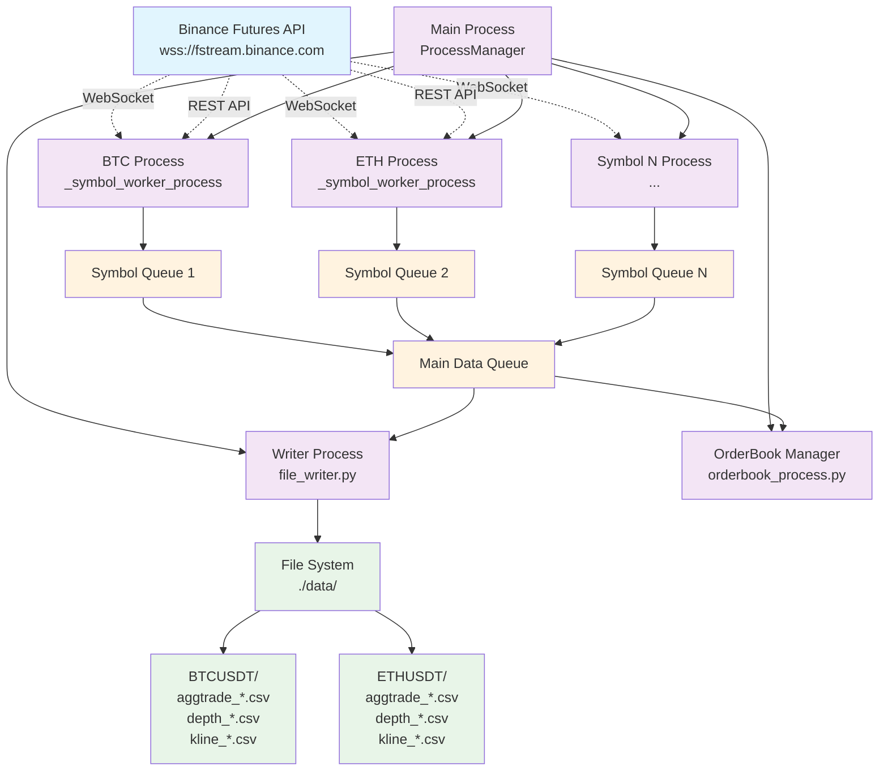
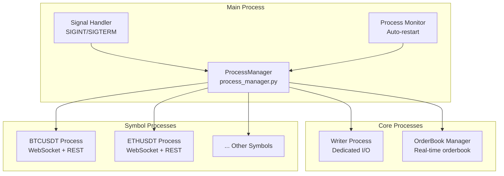
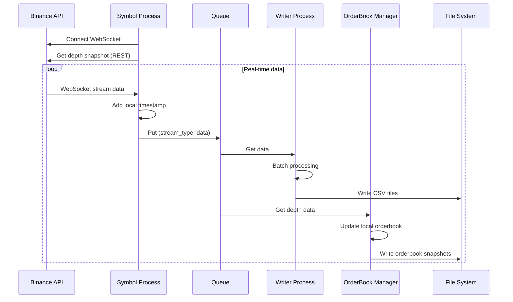
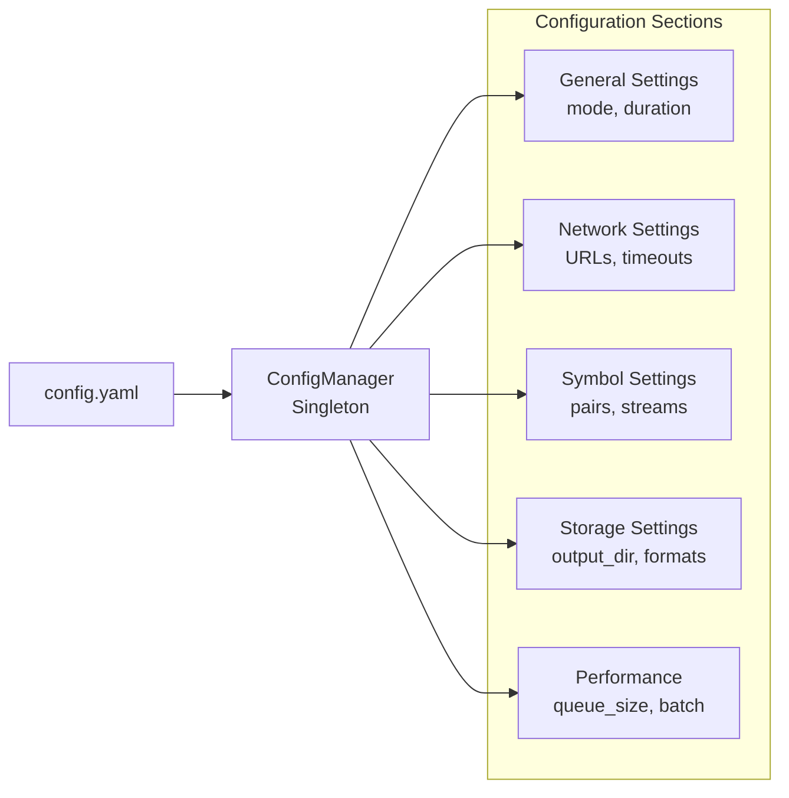

# Binance Streamer 架构设计

## 系统架构概览

## 详细组件架构

### 1. 进程管理架构

### 2. 数据流架构

### 3. 配置管理架构

## 核心组件详解

### 1. ProcessManager (`process_manager.py`)

**职责**:
- 管理所有子进程生命周期
- 处理优雅关闭信号
- 监控进程状态并自动重启关键进程

**关键特性**:
- 多进程隔离：每个交易对独立进程
- 信号处理：SIGINT/SIGTERM优雅关闭
- 进程监控：Writer进程崩溃自动重启

### 2. Symbol Worker Process (`_symbol_worker_process`)

**职责**:
- 维护单个交易对的WebSocket连接
- 获取深度快照并维护连续性
- 数据预处理和时间戳添加

**数据流类型**:
- `aggTrade`: 聚合交易数据
- `depth@0ms`: 深度更新数据
- `kline_1m`: 1分钟K线数据

### 3. File Writer (`file_writer.py`)

**职责**:
- 集中处理所有数据写入
- 批量写入优化
- 文件按日期和交易对分类

**写入策略**:
- 批量累积减少I/O
- CSV格式便于分析
- 按交易对分目录存储

### 4. OrderBook Manager (`orderbook_manager.py`)

**职责**:
- 维护实时本地订单簿
- 处理深度更新的连续性检查
- 提供最佳买卖价查询

**算法特点**:
- 基于Binance官方文档实现
- 连续性验证防止数据不一致
- 定期快照存储

## 性能特性

### 1. 多进程隔离
- **优势**: 各交易对独立运行，单点故障不影响其他
- **代价**: 进程间通信开销，内存占用较高

### 2. 批量写入
- **策略**: 累积一定数量后批量写入CSV
- **优化**: 减少磁盘I/O次数，提升写入效率

### 3. 队列缓冲
- **机制**: multiprocessing.Queue作为数据缓冲
- **容量**: 可配置队列大小，防止内存爆炸

### 4. 异步网络
- **实现**: asyncio + websockets处理并发连接
- **特性**: 自动重连，心跳检测

## 扩展性设计

### 1. 新增交易对
- 配置文件添加symbol即可
- 自动创建对应的数据目录
- 独立进程处理，不影响现有交易对

### 2. 新增数据流
- 在websocket_client中添加stream处理
- 在file_writer中添加对应的写入逻辑
- 配置文件中启用相应的stream

### 3. 存储后端扩展
- 当前支持CSV文件存储
- 可扩展支持数据库（PostgreSQL, InfluxDB等）
- 接口抽象便于切换存储方式

## 容错机制

### 1. 连接重试
- WebSocket连接断开自动重连
- 指数退避重试策略
- 最大重试次数限制

### 2. 数据完整性
- 深度数据连续性检查
- 本地时间戳记录
- 数据校验和检查

### 3. 进程恢复
- 关键进程（Writer）自动重启
- 进程状态监控
- 资源清理和恢复

## 监控和运维

### 1. 日志系统
- 分级日志记录（INFO, WARNING, ERROR）
- 文件日志轮转
- 进程级别日志隔离

### 2. 运行状态
- 守护进程模式支持
- PID文件管理
- 状态查询接口

### 3. 性能监控
- 队列积压监控
- 写入延迟统计
- 内存使用跟踪

---

**架构版本**: v1.0  
**最后更新**: 2025-08-31  
**Python版本**: 3.9+  
**主要依赖**: asyncio, websockets, pandas, aiohttp